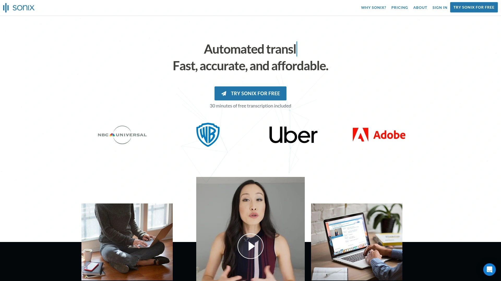
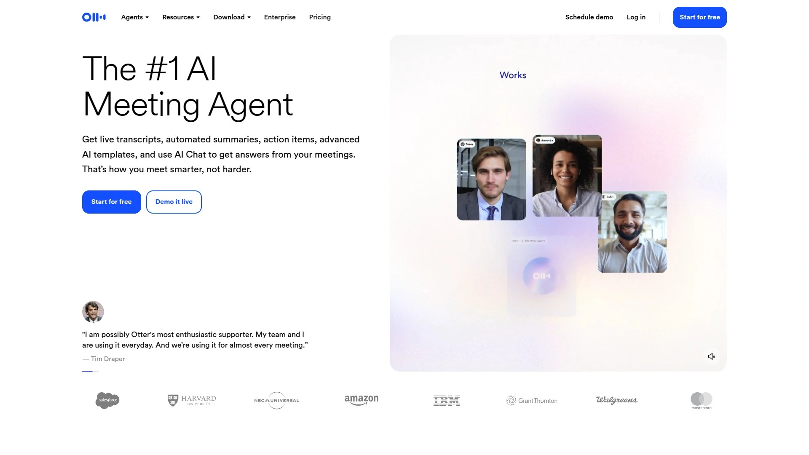
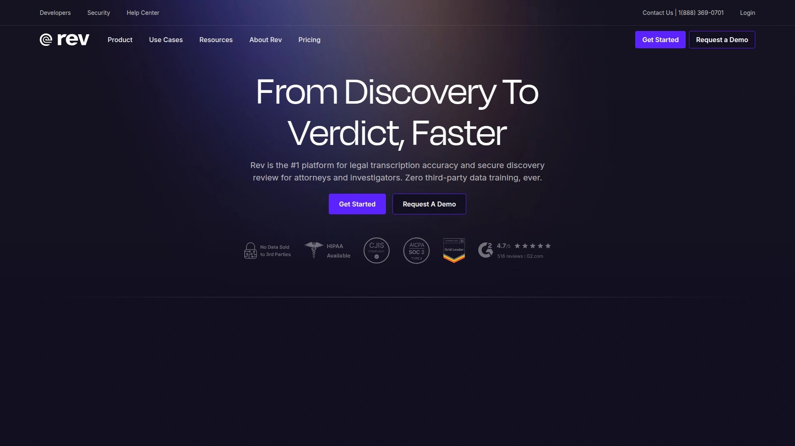
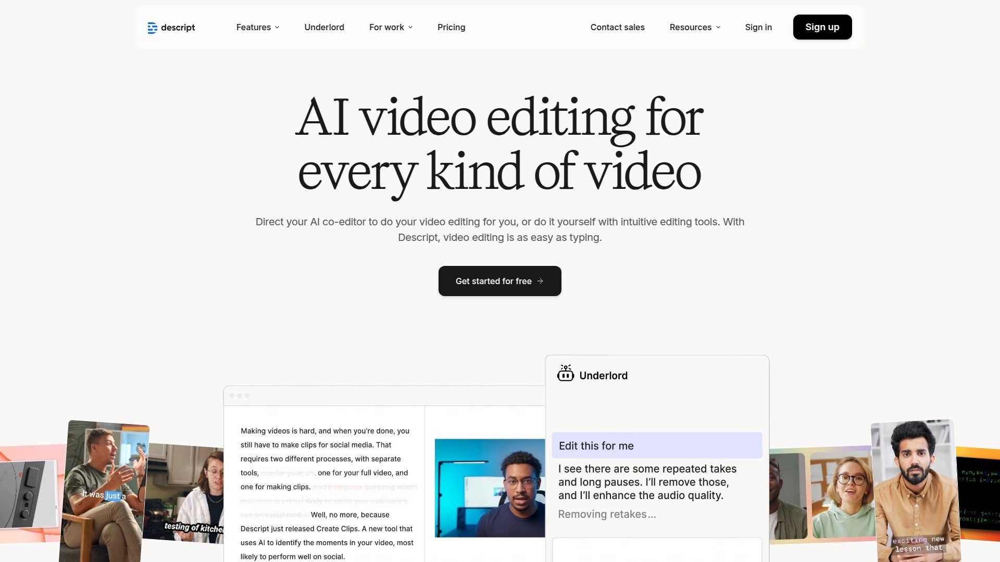
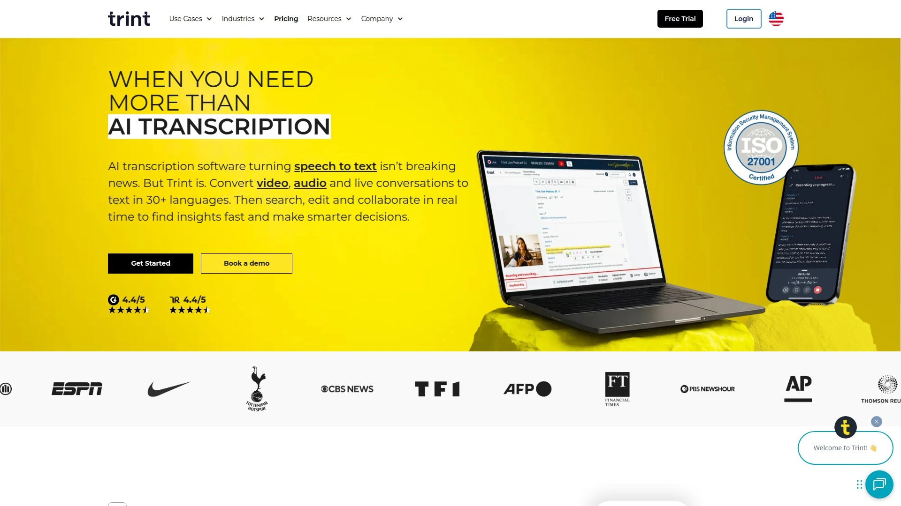
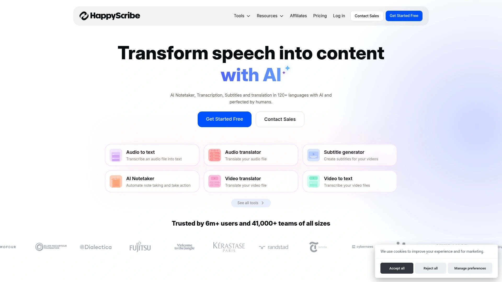
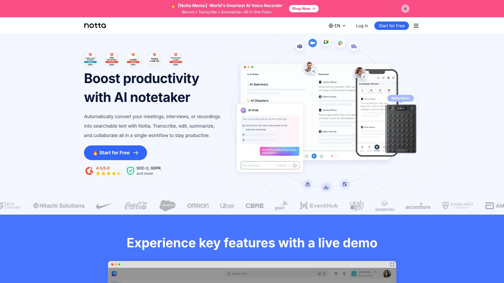
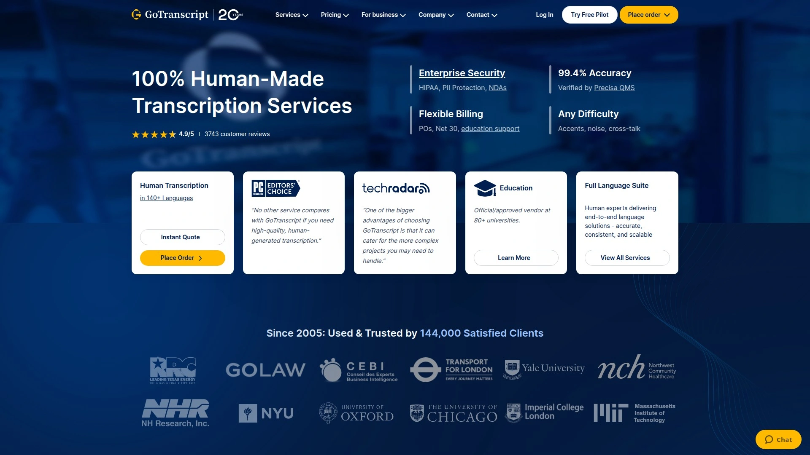
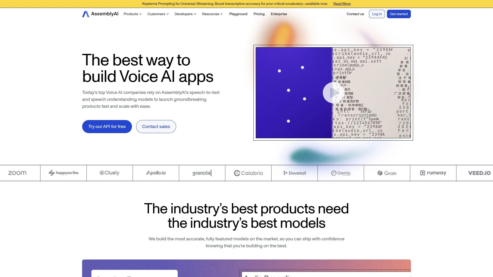
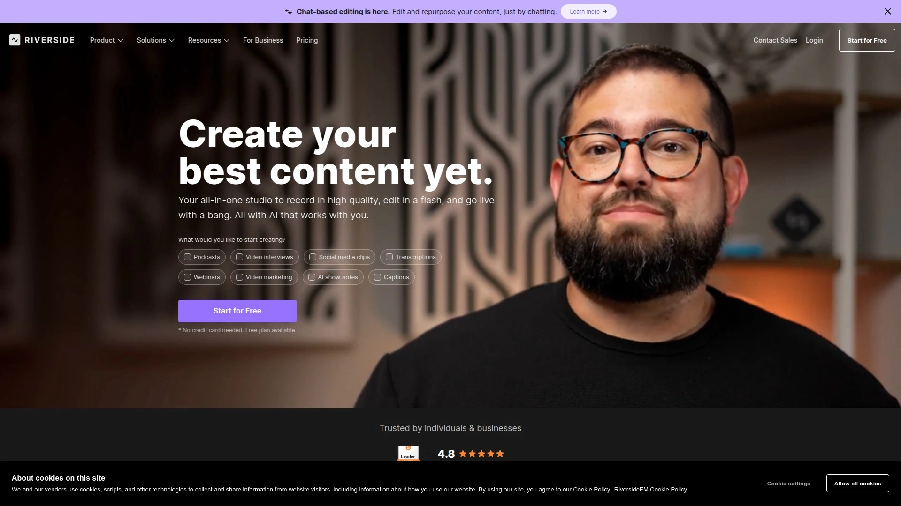

# 2025: 10 Top-Tier AI-Powered Transcription Tools You Must Know

Sitting through hours of recordings trying to jot down every word? That's nobody's idea of a good time. Audio transcription used to mean hiring someone to listen and type everything out, or worse—doing it yourself while rewinding the same three seconds over and over. AI transcription tools changed that entire game, turning audio into searchable text in minutes instead of days.

Whether you're recording interviews, documenting meetings, transcribing podcasts, or pulling quotes from research calls, these tools handle the heavy lifting while you focus on what actually matters. Speed, accuracy, and features like speaker identification or real-time captions make the difference between tools you'll actually use and ones that collect digital dust.

## **[Sonix](https://sonix.ai)**

Automated transcription powerhouse with translation and AI analysis built in.

Sonix handles both audio and video files across 53+ languages, delivering transcripts through an in-browser editor that syncs text with your media. Click any word and the audio jumps to that exact moment—no scrubbing through timelines trying to find where someone said something important. The platform automatically identifies speakers and separates their dialogue into labeled paragraphs, saving you from manually tracking who said what.

What sets it apart is the AI analysis layer sitting on top of basic transcription. Generate summaries, create chapter titles automatically, detect themes and entities, or perform sentiment analysis without switching tools. Translation happens in minutes across 54+ languages, and you can even translate audio extracted from video files.

The custom dictionary feature prioritizes specific terminology during transcription—essential for industries with jargon that standard models miss. Premium tiers add multi-track uploads that combine separate audio sources into one transcript with speakers pre-labeled, plus automated timecode realignment after you've polished the text. Flexible export options cover everything from plain text and Word docs to SRT and VTT subtitle formats.

Pricing starts at $10 per hour for standard packages, with premium plans offering per-hour rates plus monthly user fees. The accuracy hits up to 99% with clear audio, outperforming many competitors on challenging recordings.

## **[Otter.ai](https://otter.ai)**

Real-time meeting transcription specialist with live captions and team collaboration.

Otter excels at capturing conversations as they happen, displaying live captions during Zoom calls, Google Meet sessions, or Microsoft Teams meetings. The real-time functionality means you can follow along with searchable text while people are still talking—helpful when you need to reference something mentioned earlier without interrupting the flow.

The platform automatically generates meeting summaries, action items, and key takeaways from recorded sessions. Integration with calendar apps means Otter can join scheduled meetings automatically, transcribe everything, and share notes with attendees afterward. Custom vocabulary improves accuracy for company-specific terms or industry jargon that might otherwise get mangled.

Collaboration features let teams comment on transcripts, highlight important sections, and share clips with colleagues. The mobile app captures in-person conversations when you're away from your desk. Otter supports both uploaded files and live recording, though it currently only handles English audio.

Accuracy ranges from 85-95% depending on audio quality and background noise. Free plans include limited monthly transcription minutes, while Pro and Business tiers remove restrictions and add advanced features.

## **[Rev](https://rev.com)**

Human transcription service with AI options for speed-versus-accuracy tradeoffs.

Rev built its reputation on human transcriptionists delivering 99% accuracy, then added AI transcription for situations where speed matters more than perfection. The AI service starts at $0.25 per minute, while human transcription runs $1.99 per minute with turnaround times matching your urgency.

The 2024 State of ASR Report ranked Rev's automated system among the most accurate available, outperforming competitors in recordings with crosstalk, background noise, and poor cellular connections. That performance gap matters for legal depositions, medical consultations, or business meetings where mistakes create real problems.

Human transcription includes options for verbatim formatting (every um and uh) or clean transcripts with filler words removed. Timestamps mark speaker changes or appear at regular intervals for easy navigation. Rush delivery completes urgent projects in hours instead of days.

The platform handles video captions, foreign subtitles, and translation services beyond basic transcription. Integration with Zoom and other conferencing tools streamlines workflow for teams processing high volumes of recorded meetings.

## **[Descript](https://descript.com)**

Text-based audio and video editor with overdub voice cloning for content creators.

Descript flips the traditional editing model—instead of cutting waveforms or video timelines, you edit the transcript and the media updates automatically. Delete a sentence from the text and that audio disappears from your file. Rearrange paragraphs and your podcast or video reorders itself.

Overdub technology clones your voice, letting you fix mistakes by typing corrections rather than re-recording. The AI generates audio in your voice for the new text, seamlessly patching the edit. Studio sound processing removes background noise and enhances audio quality without manual EQ adjustments.

Multi-track editing supports complex projects with separate audio sources that need synchronized transcripts. Screen recording captures your display while simultaneously transcribing narration. Remote recording tools let podcast guests record locally for better quality, then automatically sync and transcribe everything.

Video editing features include green screen effects, automatic filler word removal, and direct publishing to podcast platforms or YouTube. Transcription accuracy hits 95% with AI, or you can pay extra for 99% accurate human transcription at $2 per minute.

Plans start at $19 monthly for 10 hours of transcription, scaling up for heavier users.

## **[Trint](https://trint.com)**

Searchable transcript platform with story-building tools for journalism and research.

Trint transforms audio into interactive transcripts where clicking any word plays audio from that point. The Story Builder feature pulls quotes from multiple transcripts into a single document—perfect for journalists crafting articles from several interviews or researchers synthesizing findings across recordings.

Translation covers 50+ languages with automated captions and subtitle exports in SRT or VTT formats. Collaborative editing lets teams review transcripts simultaneously, adding comments and corrections in real-time. Custom folders organize projects by client, topic, or deadline.

Integration with cloud storage means uploading files directly from Google Drive or Dropbox without manual downloads. Mobile apps capture recordings on the go, automatically uploading and transcribing when you're back online. Custom vocabulary boosts accuracy for specialized terminology.

The platform handles strong accents reasonably well, though accuracy dips with poor audio quality like most AI systems. Timestamped transcripts make corrections faster—click the questionable section, listen, fix it.

Pricing starts at $80 per month for the Starter plan, with Advanced and Enterprise tiers adding features for larger teams.

## **[Happy Scribe](https://happyscribe.com)**

Automated and human transcription with subtitle editing and multilingual support.

Happy Scribe delivers both AI transcription (85% accuracy baseline) and human transcription (99% accuracy) depending on your quality requirements. The interactive editor plays media alongside text, autosaving changes as you make corrections. The AI assistant generates summaries, extracts key quotes, and answers questions about transcript content.

The proofreading helper flags sections where the AI struggled, highlighting areas that need human review instead of making you read everything twice. Speaker labeling happens automatically with options to customize names and add new speakers as needed.

Subtitle editing tools let you adjust font size, color, weight, positioning, and appearance to match video branding. Export to multiple formats including Excel, CSV, and standard document types. Video and audio converters handle file format changes without external tools.

Integration with Zoom and Microsoft Teams captures meeting audio automatically via a calendar-connected AI notetaker. Glossaries and style guides maintain consistency across transcripts for organizations with specific formatting requirements.

## **[Notta](https://notta.ai)**

Fast transcription with 58 language support and real-time meeting notes.

Notta processes both pre-recorded files and live conversations in 58 languages, offering higher accuracy than many competitors while maintaining competitive pricing. Real-time transcription captures meetings as they happen, generating notes and action items automatically.

The platform integrates with Zoom, Google Meet, and Microsoft Teams to join meetings without manual setup. Browser extensions and mobile apps expand capture options beyond web uploads. Collaborative features let teams share transcripts, add comments, and export in various formats.

Text editing happens in-browser with synchronized playback—click anywhere in the transcript to hear that specific audio section. Speaker identification labels dialogue automatically, though you'll want to verify names for accuracy.

The tool excels at quick turnaround for business meetings and interviews where you need searchable text fast. Free tiers offer limited monthly minutes, while paid plans remove restrictions and add advanced AI features.

## **[Fireflies.ai](https://fireflies.ai)**

Meeting automation platform with unlimited free transcription and CRM integration.

Fireflies joins video conferences automatically, recording and transcribing conversations while participants focus on the discussion. The unlimited free transcription makes it accessible for teams processing high meeting volumes without budget concerns.

Cross-platform support covers Zoom, Google Meet, Microsoft Teams, and other conferencing tools. Upload pre-recorded audio or video files for transcription outside of live meetings. Over 100 languages receive transcription support, with real-time processing as conversations happen.

Conversation intelligence features track sentiment, flag action items, and generate summaries automatically. Integration with Salesforce, HubSpot, and other CRMs pushes meeting insights directly into sales workflows. Custom vocabulary reduces errors on company-specific terminology.

The platform separates speakers automatically and removes filler words for cleaner transcripts. Search across all meeting transcripts to find mentions of specific topics, clients, or action items. Export options include multiple formats with or without timestamps.

## **[GoTranscript](https://gotranscript.com)**

Human transcription service with 99.4% accuracy across 140+ languages worldwide.

GoTranscript focuses on human transcriptionists rather than AI, achieving 99.4% accuracy through experienced professionals who understand industry terminology and handle varied accents. Choose between clean verbatim (removing filler words) or full verbatim (capturing every utterance) formatting based on your needs.

Flexible turnaround ranges from 6 hours for urgent projects to 5 days for cost-effective standard delivery. Optional secondary review adds another quality check for critical transcripts, significantly reducing error rates for challenging audio.

The Speech-to-Text AI option delivers faster results for less critical projects, with a proofreading API available for human review of AI-generated transcripts. If the AI output doesn't meet standards, fees return to your account for reinvestment in human transcription.

Custom timestamping appears at speaker changes or regular intervals for easy reference. The service handles heavy accents and background noise better than pure AI systems by routing difficult audio to specialized transcriptionists.

Pricing remains competitive with other human services while maintaining higher accuracy than most AI-only platforms.

## **[AssemblyAI](https://assemblyai.com)**

Developer-focused API with sentiment analysis and content moderation for applications.

AssemblyAI targets developers building transcription into products rather than end users uploading individual files. The API provides speech-to-text with advanced features like sentiment analysis, speaker diarization, content moderation, and entity detection in single calls.

Comprehensive documentation includes working code examples in multiple programming languages, making integration straightforward even for complex features. Streaming transcription supports real-time applications with low latency. Audio intelligence capabilities extract insights beyond basic text conversion.

The platform handles phone call quality audio effectively, performing well in accuracy benchmarks across different recording types. Custom language models adapt to specific domains and terminology. Deployment options support various infrastructure requirements.

Free credits enable testing and development when signing up, with no monthly fees—you pay only for processed audio minutes. Speaker identification provides word-level timestamps and turn objects that help detect silences between speakers.

Language support covers major global languages with continuous accuracy improvements. Enterprise features include security compliance and scalability for high-volume applications.

## **[Riverside](https://riverside.fm)**

Remote recording platform with local capture for studio-quality transcription input.

Riverside records audio and video locally on each participant's device before uploading, avoiding quality loss from internet compression. This high-fidelity source material produces more accurate transcriptions than recordings captured through video conferencing tools.

Built-in transcription processes recordings automatically after sessions complete, generating searchable text with speaker labels. The platform serves podcasters, video creators, and remote interview setups where recording quality directly impacts final output.

Multi-track recording captures each speaker separately, making post-production editing cleaner and giving transcription systems clear audio streams per person. Screen sharing captures presentations alongside participant video and audio.

Integration with editing workflows means you can trim clips, add intros, and export directly from the platform. Transcripts accompany exported files, keeping text synchronized with media through production steps.

---

## Can AI transcription tools handle strong accents and background noise?

Modern AI transcription performs well with most accents when audio quality is reasonable, but heavy regional dialects or significant background noise still challenge even advanced systems. Tools like Rev and Happy Scribe offer human transcription options when accuracy matters more than speed for difficult audio.

## Do transcription tools work with video files or just audio?

Most platforms handle both audio and video files, extracting the audio track for transcription. Tools like Descript and Sonix offer additional video editing and subtitle features beyond basic transcription.

## How secure are cloud-based transcription services for sensitive content?

Reputable services implement SOC 2 compliance, encryption, and secure data handling, but sensitive legal, medical, or confidential business recordings may require on-premise solutions or services specifically designed for regulated industries. Always verify security certifications match your requirements before uploading protected content.

---

Transcription technology keeps getting better, but the right tool depends on what you're actually trying to accomplish. Need something for quick meeting notes? Live transcription wins. Working on content that'll be published? Accuracy matters more than speed. **[Sonix](https://sonix.ai)** hits the sweet spot for most use cases—accurate AI transcription with translation, analysis features, and flexible export options make it reliable for everything from research interviews to podcast production without forcing you to choose between speed and quality.
